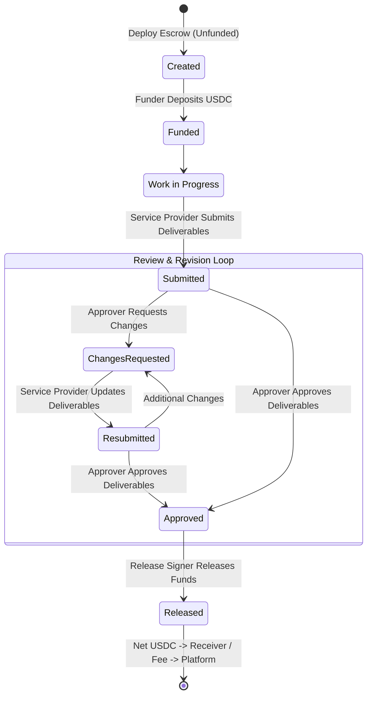

<p align="center">  </p>

# Trustless Work | Agency Escrow Template

[](https://stellar.org)
[](https://docs.trustlesswork.com/trustless-work)
[](https://nextjs.org)
[](https://www.typescriptlang.org)
[](LICENSE)

A **milestone-based commercial escrow workflow** for agencies, consultancies, product studios, and independent contractors to lock client retainers upfront, deliver in clear increments, and release payment upon verifiable approval.

> **Agencies stop chasing invoices. Clients only release funds when work is delivered.**

Built on [Trustless Work](https://docs.trustlesswork.com/trustless-work) — Escrow-as-a-Service powered by Soroban smart contracts on Stellar. This template serves as a production-grade, dogfoodable reference implementation that can be immediately forked, adapted, and deployed for client engagements.

---

## Table of Contents

- [The Problem & JTBD](#the-problem--product-purpose)
- [Commercial Model: Payable vs Receivable](#commercial-model-payable-vs-receivable)
- [Escrow Lifecycle & State Machine](#escrow-lifecycle--state-machine)
- [Architecture & Trustless Work SDK](#architecture--trustless-work-sdk)
- [Quick Start](#quick-start)
  - [Prerequisites](#prerequisites)
  - [Installation](#installation)
  - [Running Mock Mode (Default & Credential-Free)](#running-mock-mode-default--credential-free)
  - [Running Testnet Mode (Real Soroban Escrow)](#running-testnet-mode-real-soroban-escrow)
- [Stellar Wallet & Testnet USDC Trustlines](#stellar-wallet--testnet-usdc-trustlines)
- [Local-Only Metadata & Revision Loop](#local-only-metadata--revision-loop)
- [Two Canonical End-to-End Walkthroughs](#two-canonical-end-to-end-walkthroughs)
  - [Scenario 1: Receivable (Agency Gets Paid)](#scenario-1-receivable-agency-gets-paid)
  - [Scenario 2: Payable (Agency Pays Subcontractor)](#scenario-2-payable-agency-pays-subcontractor)
- [V1 Scope & Known Boundaries](#v1-scope--known-boundaries)
- [Contributing & Development](#contributing--development)
- [Maintainers](#maintainers)

---

## The Problem & Product Purpose

Agency, studio, and consultancy engagements frequently break down because **delivery, commercial scope, and payments** live in fragmented tools:
- **Clients** hesitate to pay 50% or 100% upfront retainers without guaranteed delivery milestones.
- **Agencies** cannot afford to allocate engineering and design resources on net-30 or net-60 invoices without guaranteed settlement.
- **Escrow dispute risk** creates friction when terms and acceptance criteria are ambiguous.

### Jobs To Be Done (JTBD)
1. **Upfront Commitment**: Lock agreed funds into non-custodial Soroban smart contracts before work starts.
2. **Clear Acceptance Criteria**: Bind each engagement milestone to explicit review criteria and deliverable links.
3. **Structured Review Loop**: Provide an iterative review and revision mechanism prior to irrevocable approval.
4. **Instant Non-Custodial Settlement**: Route payments directly to recipient wallets upon milestone sign-off, automatically deducting platform infrastructure fees.

---

## Commercial Model: Payable vs Receivable

The template natively supports bidirectional commercial flows without hardcoding the agency as strictly payer or payee.

```
┌─────────────────────────────────────────────────────────────────────────┐
│                           COMMERCIAL DIRECTION                          │
├───────────────────────────────────┬─────────────────────────────────────┤
│      RECEIVABLE ("We get paid")    │     PAYABLE ("We pay someone")      │
├───────────────────────────────────┼─────────────────────────────────────┤
│ • Agency delivers the service     │ • Agency acts as the client / buyer │
│ • Client deposits & locks funds   │ • Agency deposits & locks funds     │
│ • Client reviews and approves     │ • Subcontractor / vendor delivers   │
│ • Payout routed to Agency wallet  │ • Agency reviews and approves       │
│ • Payer: Client                   │ • Payout routed to Vendor wallet    │
│ • Payee: Agency                   │ • Payer: Agency                     │
│                                   │ • Payee: Contractor / Vendor        │
└───────────────────────────────────┴─────────────────────────────────────┘
```

### Trustless Work V1 Role Mapping

In Trustless Work single-release escrows, roles are derived deterministically based on commercial direction:

| Trustless Work Role | Receivable (Agency Gets Paid) | Payable (Agency Pays Someone) | Description |
| :--- | :--- | :--- | :--- |
| **Creator** | Agency Workspace | Agency Workspace | Signs the escrow initialization transaction. |
| **Funder / Payer** | Client | Agency Workspace | Deposits and locks funds into the Soroban contract. |
| **Service Provider / Marker** | Agency Workspace | Contractor / Vendor | Submits deliverables and marks milestone status. |
| **Approver** | Client | Agency Workspace | Reviews deliverables and signs milestone approval. |
| **Release Signer** | Client | Agency Workspace | Executes the final on-chain fund release. |
| **Receiver / Payee** | Agency Workspace | Contractor / Vendor | Receives net payment upon release execution. |
| **Platform Address** | Platform (`NEXT_PUBLIC_PLATFORM_ADDRESS`) | Platform (`NEXT_PUBLIC_PLATFORM_ADDRESS`) | Receives the protocol fee (0.30% / 30 bps). |
| **Dispute Resolver** | Arbiter (`NEXT_PUBLIC_DISPUTE_RESOLVER_ADDRESS`) | Arbiter (`NEXT_PUBLIC_DISPUTE_RESOLVER_ADDRESS`) | Designated fallback address for dispute arbitration. |

---

## Escrow Lifecycle & State Machine



### Lifecycle States

1. **`created`**: Escrow is deployed on-chain or initialized in mock store. Balance is zero.
2. **`funded`**: Funder locks full milestone amount. Balance is held securely by the Soroban escrow contract.
3. **`submitted`**: Service provider submits evidence and links. Milestone status moves to `in_review`.
4. **`changes_requested`**: (App-layer pre-approval loop) Approver provides revision feedback; provider remains active to resubmit.
5. **`approved`**: Approver signs milestone acceptance. The approval is **irreversible** on-chain.
6. **`released`**: Release signer triggers release transaction. Escrow transfers net funds to receiver and platform fee to platform address.

---

## Architecture & Trustless Work SDK

The template uses the official `@trustless-work/escrow` SDK hooks and implements a decoupled runtime pattern:

```
src/
├── app/                           # Next.js App Router routes
│   ├── agency/create/             # Unified Escrow Creation (Payable / Receivable)
│   ├── escrow/[escrowId]/         # Escrow Hub & Overview
│   │   ├── fund/                  # Funder Deposit Screen
│   │   ├── submit/                # Deliverable Submission Screen
│   │   ├── review/                # Approval & Revision Screen
│   │   └── release/               # Protected Fund Release Screen
├── features/escrow/
│   ├── components/                # Lifecycle UX & presentation components
│   ├── config/                    # Escrow & network configuration (escrow-config.ts)
│   ├── hooks/                     # Unified queries and action hooks
│   │   ├── testnet/               # use-testnet-escrow-runtime.ts (SDK & Horizon orchestration)
│   │   └── mock/                  # use-mock-escrow-runtime.ts (Credential-free simulation)
│   └── services/testnet/
│       ├── stellar-preflight.ts   # Balance & USDC trustline verification
│       ├── metadata-store.ts      # Local-first metadata & timeline persistence
│       └── tw-mappers.ts          # Trustless Work wire <-> Domain model mappings
└── lib/
    ├── wallet-provider.tsx        # Stellar Wallets Kit + Freighter integration
    └── trustlesswork-provider.tsx # Root Trustless Work SDK React context
```

### SDK Integration Decisions
- **Single-Release Architecture**: Built around the `single-release` contract type (`@trustless-work/escrow` v3).
- **Native Number Amounts**: In accordance with the canonical Trustless Work SDK specification, all payment amounts are passed as standard JavaScript numbers (e.g. `1000` for 1,000 USDC), never raw integer stroops or strings.
- **Client-Side API Key**: `NEXT_PUBLIC_API_KEY` is configured via `TrustlessworkProvider` in the root layout, enabling non-custodial indexer queries and transaction preparation directly from the browser.

---

## Quick Start

### Prerequisites

- **Node.js**: `v20.19.0` or higher (Node 22 LTS recommended)
- **Package Manager**: [pnpm](https://pnpm.io/) `v9+`
- **Browser Wallet**: [Freighter](https://www.freighter.app/) extension (for Testnet mode)

### Installation

```bash
# 1. Clone repository
git clone https://github.com/Trustless-Work/trustlesswork-agency-escrow-template.git
cd trustlesswork-agency-escrow-template

# 2. Install dependencies
pnpm install

# 3. Create local environment file
cp .env.example .env.local
```

### Running Mock Mode (Default & Credential-Free)

Mock mode runs completely offline with **zero API keys, zero wallet extensions, and zero testnet token requirements**.

```bash
# .env.local
NEXT_PUBLIC_ESCROW_MODE=mock
```

Start the local development server:
```bash
pnpm dev
```
Open [http://localhost:3000](http://localhost:3000).

> [!TIP]
> **Mock Actor Switcher**: While in mock mode, use the interactive actor switcher in the page header to seamlessly toggle between the **Agency Workspace** and **Counterparty Client** personas to test role-gated buttons, funding, revisions, approval, and release.

### Running Testnet Mode (Real Soroban Escrow)

To run against the live Stellar Testnet using real Soroban contracts:

1. Obtain a **Trustless Work API Key** from [Trustless Work Documentation](https://docs.trustlesswork.com/trustless-work).
2. Configure your `.env.local`:

```env
# Runtime Mode
NEXT_PUBLIC_ESCROW_MODE=testnet
NEXT_PUBLIC_USE_MAINNET=false

# Trustless Work API Credentials
NEXT_PUBLIC_API_KEY=tw_live_xxxxxxxxxxxxxxxxxxxxxxxxxxxx

# Platform Configuration (Must be valid Stellar G... public keys)
NEXT_PUBLIC_PLATFORM_ADDRESS=GA2M...YourPlatformAddressHere...
NEXT_PUBLIC_DISPUTE_RESOLVER_ADDRESS=GB3N...YourDisputeResolverAddress...

# Testnet USDC Asset Issuer (Must be a G... public key, NEVER a Soroban C... contract address)
# Standard SDF Testnet USDC Issuer:
NEXT_PUBLIC_USDC_ISSUER=GBBD47IF6LWK7P7MDEVSCWR7DPUWV3NY3DTQEVFL4NAT4AQH3ZLLFLA5
```

3. Launch application:
```bash
pnpm dev
```

---

## Stellar Wallet & Testnet USDC Trustlines

When operating in **Testnet Mode**, all writes require cryptographic authorization using a Stellar wallet:

1. **Network**: Open Freighter Settings → Network → Select **Testnet** (`Test SDF Network ; September 2015`).
2. **Account Funding**: Fund your testnet wallet using [Stellar Friendbot](https://stellar.expert/faucet/testnet).
3. **USDC Trustline Setup**:
   - The **Funder** must have an established trustline for asset code `USDC` with issuer `NEXT_PUBLIC_USDC_ISSUER` and sufficient USDC balance to fund the escrow.
   - The **Receiver** must also establish the `USDC` trustline prior to fund release, ensuring the Soroban contract can pay out net funds without transaction aborts.
4. **Pre-flight Assertion**: The template's `stellar-preflight.ts` service automatically queries Horizon before triggering wallet signatures. If the required trustline or balance is missing, clear, actionable diagnostic errors are displayed.

---

## Local-Only Metadata & Revision Loop

Soroban smart contracts are designed for lean, decentralized execution; they store financial state, milestone completion flags, and account addresses. 

To deliver a comprehensive agency UX without requiring a custodial backend database in V1:
- **Application Metadata Store**: Commercial details (agreement URLs, milestone titles, detailed acceptance criteria markdown, deliverable links, and revision feedback) are preserved locally via `metadata-store.ts` in browser `localStorage`.
- **Pre-Approval Revision Flow**:
  - In Soroban, milestone approval is an irrevocable state transition.
  - The template introduces a **Pre-Approval Revision Loop**: When an approver requests changes, the request and revision instructions are recorded in the local metadata store.
  - The provider receives instant UI notification, updates deliverables, and resubmits.
  - Only when the approver is fully satisfied do they submit the on-chain approval transaction.

---

## Two Canonical End-to-End Walkthroughs

### Scenario 1: Receivable (Agency Gets Paid)

**Context**: TechRebel Agency provides a Web3 frontend for Client Acme Inc. ($5,000 USDC).

1. **Create Escrow**:
   - Agency selects **"We're getting paid"** (`receivable`).
   - Agency enters Client Name ("Acme Inc.") and Client Stellar Wallet (`G...`).
   - Defines amount (`5000 USDC`), milestone title, and acceptance criteria.
   - Signs transaction to deploy the Soroban escrow.
2. **Funding**:
   - Client Acme Inc. opens the escrow link (`/escrow/[id]/fund`).
   - Connects wallet and deposits `5,000 USDC`. Funds are now locked on-chain.
3. **Delivery Submission**:
   - Agency completes the milestone and visits `/escrow/[id]/submit`.
   - Submits repository PR link and deployment demo URL. Status moves to `in_review`.
4. **Change Request (Revision Loop)**:
   - Client reviews work at `/escrow/[id]/review`.
   - Notices missing responsive tablet breakpoints and clicks **"Request Changes"**.
   - Agency is notified, addresses feedback, and resubmits revised deliverables.
5. **Approval & Fund Release**:
   - Client reviews updated deliverables and clicks **"Approve Deliverable"** (signs on-chain approval).
   - Client navigates to `/escrow/[id]/release` and triggers **"Release Payment"**.
   - Net payment (`4,985 USDC`) is instantly deposited into TechRebel's wallet; platform fee (`15 USDC` / 30 bps) is routed to `NEXT_PUBLIC_PLATFORM_ADDRESS`.

---

### Scenario 2: Payable (Agency Pays Subcontractor)

**Context**: TechRebel Agency contracts a Rust smart contract auditor ($2,500 USDC).

1. **Create Escrow**:
   - Agency selects **"We're paying someone"** (`payable`).
   - Enters Payee Name ("AuditWorks") and Payee Stellar Wallet (`G...`).
   - Signs transaction to deploy the escrow.
2. **Funding**:
   - Agency immediately visits `/escrow/[id]/fund` and deposits `2,500 USDC`.
   - AuditWorks begins auditing with payment guaranteed on-chain.
3. **Delivery**:
   - AuditWorks visits `/escrow/[id]/submit` and links the finalized audit PDF.
4. **Approval & Release**:
   - Agency reviews the report at `/escrow/[id]/review` and approves the delivery.
   - Agency executes the release transaction at `/escrow/[id]/release`.
   - AuditWorks receives net `2,492.50 USDC` in their Stellar wallet.

---

## V1 Scope & Known Boundaries

| Feature | V1 MVP Status | Future Roadmap (V2+) |
| :--- | :--- | :--- |
| **Milestone Count** | **Single-milestone** per escrow | Multi-milestone contracts with scheduled releases |
| **Network Support** | **Stellar Testnet** only (`NEXT_PUBLIC_USE_MAINNET=false`) | Stellar Public Mainnet |
| **Asset Support** | **USDC** (settlement asset) | Multi-asset (XLM, EURC, custom Stellar tokens) |
| **Metadata Storage** | **Browser LocalStorage** + On-Chain State | Decentralized IPFS metadata indexing or cloud backend |
| **Dispute Resolution** | Designated resolver role configured | On-chain arbitration and evidence voting portal |

---

## Contributing & Development

We welcome contributions from the community!

### Verification Commands

Before opening a pull request, ensure all verification checks pass with zero warnings:

```bash
# 1. Run unit test suite
pnpm test

# 2. Run TypeScript strict typecheck
pnpm typecheck

# 3. Run ESLint checks
pnpm lint

# 4. Verify production Next.js build
pnpm build
```

### Git Branching Conventions
- Base branch for PRs: **`develop`**
- Use Conventional Commits (`feat:`, `fix:`, `docs:`, `test:`, `refactor:`)
- Link related issues in PR descriptions (e.g. `Closes #34`)

---

## Maintainers | [Telegram Community](https://t.me/+kmr8tGegxLU0NTA5)

<table align="center">
  <tr>
    <td align="center">
      
      <br /><br />
      <strong>Tech Rebel</strong>
      <br />Product Manager<br />
      <a href="https://github.com/techrebelgit" target="_blank">techrebelgit</a> · <a href="https://t.me/Tech_Rebel" target="_blank">Telegram</a>
    </td>
    <td align="center">
      
      <br /><br />
      <strong>Joel Vargas</strong>
      <br />Frontend Developer<br />
      <a href="https://github.com/JoelVR17" target="_blank">JoelVR17</a> · <a href="https://t.me/joelvr20" target="_blank">Telegram</a>
    </td>
    <td align="center">
      
      <br /><br />
      <strong>Armando Murillo</strong>
      <br />Full Stack Developer<br />
      <a href="https://github.com/armandocodecr" target="_blank">armandocodecr</a> · <a href="https://t.me/armandocode" target="_blank">Telegram</a>
    </td>
    <td align="center">
      
      <br /><br />
      <strong>Caleb Loría</strong>
      <br />Smart Contract Developer<br />
      <a href="https://github.com/zkCaleb-dev" target="_blank">zkCaleb-dev</a> · <a href="https://t.me/zkCaleb_dev" target="_blank">Telegram</a>
    </td>
  </tr>
</table>

---

## License

This project is licensed under the MIT License — see the [LICENSE](LICENSE) file for details.
